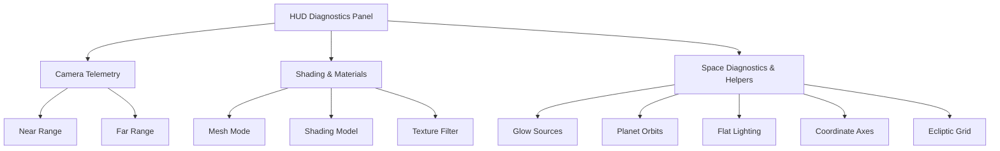

# KỊCH BẢN DEMO & GIẢI THÍCH CHI TIẾT BẢNG ĐIỀU KHIỂN GUI DIAGNOSTICS

Tài liệu này được biên soạn nhằm hướng dẫn chi tiết kịch bản thuyết trình demo sản phẩm **Mô phỏng Hệ Mặt Trời 3D** phục vụ bảo vệ đồ án môn học Đồ họa máy tính tại UIT, đồng thời giải thích cặn kẽ ý nghĩa toán học/đồ họa của từng thông số trong bảng điều khiển kỹ thuật **HUD Diagnostics** (`lil-gui`).

---

# PHẦN 1: KỊCH BẢN DEMO THUYẾT TRÌNH BẢO VỆ ĐỒ ÁN (6 BƯỚC)

Kịch bản demo dưới đây kéo dài từ **5 - 7 phút**, được phân chia theo luồng tương tác khoa học, đi từ tổng quan đến chi tiết các kỹ thuật đồ họa nâng cao.

---

### BƯỚC 1: KHỞI ĐỘNG VÀ GIỚI THIỆU TỔNG QUAN KHÔNG GIAN CẢNH 3D (60 giây)
- **Thao tác thực hiện:**
  1. Mở trình duyệt tại địa chỉ chạy local: `http://localhost:5173`.
  2. Dùng chuột kéo xoay nhẹ trong cảnh để hội đồng thấy toàn bộ Hệ Mặt Trời đang chuyển động tự nhiên.
  3. Dùng nút cuộn chuột (scroll wheel) để zoom ra xa, cho thấy toàn cảnh không gian vũ trụ rộng lớn.
- **Nội dung thuyết trình mẫu:**
  > *"Kính thưa Hội đồng, đây là giao diện chính của chương trình Mô phỏng Hệ Mặt Trời 3D tương tác thời gian thực của nhóm chúng em. Ngay khi khởi động, hệ thống sẽ khởi tạo một scene 3D với Mặt Trời nằm tại trung tâm đóng vai trò là nguồn sáng PointLight tỏa nhiệt năng lượng cao. Bao quanh là 8 hành tinh chuyển động theo quỹ đạo elip lệch tâm và nghiêng lệch góc so với mặt phẳng quỹ đạo chuẩn. Nền không gian được tô điểm bởi hơn 1000 ngôi sao lấp lánh (sử dụng kỹ thuật hạt Points với độ đục opacity dao động ngẫu nhiên theo hàm sin để tạo hiệu ứng nhấp nháy thực tế) cùng các đám mây tinh vân (nebula dust) đa sắc màu."*

---

### BƯỚC 2: TƯƠNG TÁC CHỌN HÀNH TINH & KHÁM PHÁ THÔNG TIN HOLOGRAPHIC (90 giây)
- **Thao tác thực hiện:**
  1. Click chuột trực tiếp vào **Trái Đất (Earth)** trên màn hình 3D (hoặc bấm chọn Earth từ danh sách **ORBITAL FLEET** ở sidebar bên trái).
  2. Quan sát hiệu ứng camera bay mượt mà đến Trái Đất và vòng khóa mục tiêu Reticle xuất hiện xoay tròn bao quanh hành tinh.
  3. Chỉ tay vào bảng thông tin bên phải **INFO PANEL** hiển thị các thông số kỹ thuật (Loại, Chu kỳ quỹ đạo, Đường kính, Khoảng cách thực tế).
  4. Zoom gần vào Trái Đất để thấy rõ **Mặt Trăng (Moon)** đang tự xoay quanh Trái Đất.
- **Nội dung thuyết trình mẫu:**
  > *"Để tương tác với các thiên thể, chúng em tích hợp kỹ thuật Raycasting chuyển đổi tọa độ chuột màn hình 2D thành tia bắn trong không gian 3D để xác định điểm giao cắt với Mesh hành tinh. Khi chọn Trái Đất, thư viện GSAP sẽ tự động làm mịn đường đi của camera (Camera Interpolation) để bay mượt tới mục tiêu, đồng thời kích hoạt vòng khóa mục tiêu Reticle bám theo chuyển động thực tế. Ở đây hội đồng cũng có thể quan sát mô hình Scene Graph phân cấp: Trái Đất là nút cha chứa Mặt Trăng là nút con, tự xoay quanh nút cha một cách độc lập."*

---

### BƯỚC 3: TRÌNH DIỄN BẢNG CHẨN ĐOÁN HUD DIAGNOSTICS & KỸ THUẬT ĐỒ HỌA (120 giây)
- **Thao tác thực hiện:**
  1. Click vào tiêu đề **HUD DIAGNOSTICS** ở góc trên bên phải để mở bảng điều khiển `lil-gui`.
  2. Tại mục **Graphics Settings / Shading Model**, chuyển từ `PBR` lần lượt sang:
     - `Phong` và `Lambert`: để thấy rõ sự khác biệt về độ bóng và phản xạ khuếch tán bề mặt.
     - `Normal`: giải thích về việc tính toán pháp tuyến bề mặt (hành tinh sẽ hiển thị màu sắc RGB tương ứng với vector pháp tuyến).
     - `Basic (Unlit)`: chế độ tô bóng phẳng, không phụ thuộc nguồn sáng.
  3. Tích chọn checkbox **Flat Lighting**: Quan sát các hành tinh sáng rõ 100% bề mặt texture, không bị bóng tối hay đổ bóng che khuất.
  4. Tại mục **Texture Filter**, chuyển đổi qua lại giữa `Linear (Smooth)` và `Nearest (Pixelated)` để chứng minh thuật toán nội suy ảnh texture.
  5. Bật checkbox **Show Axes** và **Show Grid** để hiển thị 3 trục tọa độ RGB và lưới mặt phẳng quỹ đạo chuẩn.
- **Nội dung thuyết trình mẫu:**
  > *"Để phục vụ học phần Đồ họa máy tính, chúng em xây dựng bảng HUD Diagnostics chuyên sâu. Chúng em có thể thay đổi mô hình tô bóng (Shading Model) thời gian thực từ PBR sang Phong, Lambert để kiểm chứng thuật toán chiếu sáng. Đặc biệt, chế độ Normal Shading hiển thị rõ hướng vector pháp tuyến của từng pixel trên khối cầu. Chức năng Flat Lighting tắt toàn bộ bóng tối để hỗ trợ quan sát rõ bề mặt texture. Chúng em cũng tích hợp bộ lọc texture lọc mượt Linear hoặc lọc răng cưa Nearest để so sánh chất lượng hình ảnh, kèm theo trục tọa độ AxesHelper giúp định vị không gian 3D trực quan."*

---

### BƯỚC 4: TRẢI NGHIỆM ĐỘC ĐÁO "VIEW FROM PLANET" (FIRST-PERSON VIEW) (60 giây)
- **Thao tác thực hiện:**
  1. Khi đang khóa mục tiêu tại Trái Đất, click vào nút **VIEW FROM PLANET** màu xanh ngọc trên bảng thông tin.
  2. Trình duyệt chuyển sang góc nhìn thứ nhất. Giữ và kéo chuột để xoay camera nhìn xung quanh không gian.
  3. Nhìn thấy Mặt Trời và các hành tinh khác đang di chuyển trên bầu trời từ góc nhìn bề mặt Trái Đất.
  4. Click lại nút đó một lần nữa để thoát chế độ.
- **Nội dung thuyết trình mẫu:**
  > *"Chúng em đã thiết kế một tính năng độc đáo là View From Planet. Khi kích hoạt, hệ thống sẽ ẩn mesh của Trái Đất để tránh che khuất camera, đồng thời khóa cứng tọa độ camera trùng với tọa độ thực tế của Trái Đất. Vì Trái Đất vẫn chuyển động trên quỹ đạo elip, camera sẽ liên tục trôi theo không gian. Người thuyết trình có thể kéo chuột để xoay hướng nhìn tự do, mang lại trải nghiệm đứng trên bề mặt hành tinh quan sát vũ trụ xung quanh vô cùng chân thực."*

---

### BƯỚC 5: CHẾ ĐỘ THAM QUAN TỰ ĐỘNG AUTOPILOT TOUR (60 giây)
- **Thao tác thực hiện:**
  1. Click vào nút **AUTOPILOT TOUR** trên sidebar bên trái (hoặc trong bảng GUI).
  2. Buông chuột hoàn toàn, quan sát hệ thống tự động tăng FOV đột ngột (tạo hiệu ứng Warp/phóng nhanh qua lỗ sâu) rồi bay sang hành tinh tiếp theo (ví dụ: Sao Hỏa, Sao Mộc).
- **Nội dung thuyết trình mẫu:**
  > *"Chế độ Autopilot Tour là tính năng tự động hóa hành trình. Khi kích hoạt, chương trình tự động chạy một bộ lập lịch thời gian. Sau mỗi 10 giây, hệ thống sẽ tự động chọn hành tinh tiếp theo trong danh sách, kết hợp hiệu ứng thay đổi góc nhìn Field of View (FOV) đột ngột để tạo cảm giác phi thuyền đang kích hoạt động cơ bẻ cong không gian (Warp Drive), giúp bài thuyết trình tự vận hành vô cùng sinh động."*

---

### BƯỚC 6: ĐIỀU KHIỂN CHRONOS CONTROLS & ĐỊNH LUẬT KEPLER VẬT LÝ (60 giây)
- **Thao tác thực hiện:**
  1. Tại thanh điều khiển footer, click lần lượt vào các nút tốc độ: `PAUSE` (mô phỏng đứng im), `10X` (mô phỏng chuyển động siêu tốc).
  2. Quan sát ngày Sol và Year trên HUD nhảy số cực nhanh.
  3. Chỉ ra sự thay đổi vận tốc của Thủy Tinh (Mercury) khi ở gần Mặt Trời (điểm cận nhật) chạy rất nhanh và khi ra xa (điểm viễn nhật) chạy chậm lại rõ rệt.
- **Nội dung thuyết trình mẫu:**
  > *"Cuối cùng, hệ thống Chronos Controls cho phép thay đổi tốc độ dòng thời gian của toàn bộ hệ từ dừng hẳn (Pause) cho đến tăng tốc gấp 10 lần. Chúng em đã áp dụng định luật Kepler để tính toán vận tốc quỹ đạo tức thời, đồng thời đồng bộ hóa thông minh tốc độ tự quay quanh trục của hành tinh tỷ lệ thuận với tốc độ dòng thời gian của hệ. Khi chúng em tăng tốc thời gian ở footer, cả chuyển động quỹ đạo elip lẫn chuyển động tự xoay quanh trục Y của các hành tinh đều tăng tốc đồng bộ mượt mà, đảm bảo tính nhất quán tuyệt đối về mặt thời gian mô phỏng."*

---

### KẾT LUẬN DEMO:
- Bấm nút **DISCONNECT SCANNER** để đưa camera về vị trí toàn cảnh.
- Cúi đầu chào và gửi lời cảm ơn tới Hội đồng.

---

# PHẦN 2: GIẢI THÍCH CHI TIẾT CÁC TRƯỜNG TRONG BẢNG "HUD DIAGNOSTICS" (GUI)

Bảng điều khiển **HUD Diagnostics** được tổ chức thành 3 thư mục lớn, cung cấp khả năng can thiệp trực tiếp vào quy trình render (Graphics Pipeline) và điều khiển camera.

---

## 1. Thư mục: CAMERA TELEMETRY (Trắc lượng học Camera)

Thư mục này cho phép can thiệp vào các tham số toán học của **Perspective Camera (Camera phối cảnh)**, điều khiển trực tiếp thể tích quan sát (View Frustum) của camera.

### 1.1. Near Range (Mặt phẳng cắt gần)
- **Kiểu dữ liệu:** Slider (Nhận giá trị từ `0.05` đến `5.0`).
- **Ý nghĩa toán học/đồ họa:** 
  * Đây là khoảng cách từ tâm camera đến **mặt phẳng cắt gần (Near Clipping Plane)**.
  * Bất kỳ vật thể nào nằm gần camera hơn giá trị `near` sẽ bị loại bỏ khỏi quy trình render (Culling).
- **Thử nghiệm tương tác:** Khi zoom sát vào một hành tinh và tăng `Near Range` lên `5.0`, bạn sẽ thấy bề mặt hành tinh ở gần bị "cắt lẹm" rỗng ruột. Điều này chứng minh mặt phẳng cắt gần đang hoạt động đúng.

### 1.2. Far Range (Mặt phẳng cắt xa)
- **Kiểu dữ liệu:** Slider (Nhận giá trị từ `500` đến `4000`).
- **Ý nghĩa toán học/đồ họa:**
  * Đây là khoảng cách từ tâm camera đến **mặt phẳng cắt xa (Far Clipping Plane)**.
  * Bất kỳ vật thể nào nằm xa camera hơn giá trị `far` sẽ bị loại bỏ khỏi quy trình render để tiết kiệm tài nguyên GPU.
- **Thử nghiệm tương tác:** Khi kéo `Far Range` về giá trị nhỏ nhất (`500`), các ngôi sao ở nền xa và các hành tinh ở rìa ngoài hệ như Thiên Vương Tinh, Hải Vương Tinh sẽ đột ngột biến mất khỏi tầm nhìn.

---

## 2. Thư mục: SHADING & MATERIALS (Tô bóng & Vật liệu)

Thư mục này can thiệp trực tiếp vào thuật toán xử lý ánh sáng và nội suy điểm ảnh trên bề mặt vật thể 3D.

### 2.1. Mesh Mode (Chế độ lưới đa giác)
- **Giá trị lựa chọn:** `Solid` (Đặc) / `Wireframe` (Khung dây).
- **Ý nghĩa toán học/đồ họa:**
  * **Solid (Mặc định):** Trình diễn vật thể dưới dạng bề mặt đặc, được tô bóng và áp texture đầy đủ.
  * **Wireframe:** Bỏ qua khâu tô màu bề mặt, chỉ render các đường biên nối giữa các đỉnh (vertex) tạo nên các tam giác đa giác (Polygon Triangles) cấu tạo khối cầu.
- **Ý nghĩa giáo dục:** Giúp hội đồng thấy rõ mật độ lưới hình cầu (`SphereGeometry`) đang được sử dụng để giả lập bề mặt tròn trịa mịn màng của hành tinh trong WebGL.

### 2.2. Shading Model (Mô hình tô bóng ánh sáng)
Đây là phần **cốt lõi** thể hiện kiến thức môn học Đồ họa máy tính. Cho phép thay đổi thuật toán tô bóng thời gian thực:
- **Standard (PBR - Physically Based Rendering):**
  * *Nguyên lý:* Sử dụng các phương trình vật lý thực tế để tính toán phản xạ ánh sáng (thông qua độ nhám Roughness và độ kim loại Metalness).
  * *Kết quả:* Vật liệu trông vô cùng chân thực, có phản chiếu môi trường và chiều sâu cao.
- **Phong (Mô hình chiếu sáng Phong):**
  * *Nguyên lý:* Tính toán màu sắc tại từng pixel dựa trên sự kết hợp của 3 thành phần: Ánh sáng môi trường (Ambient), Ánh sáng khuếch tán (Diffuse - định luật Lambert), và Ánh sáng phản xạ gương (Specular).
  * *Kết quả:* Xuất hiện đốm sáng bóng loáng (specular highlight) đặc trưng trên bề mặt khi hướng nhìn vuông góc với hướng phản xạ.
- **Lambert (Mô hình chiếu sáng Lambert):**
  * *Nguyên lý:* Chỉ tính toán thành phần Ambient và Diffuse. Cường độ sáng khuếch tán tỷ lệ thuận với cosin của góc giữa pháp tuyến bề mặt và hướng nguồn sáng.
  * *Kết quả:* Bề mặt trông nhám mịn, không có phản xạ gương bóng loáng (phù hợp với các hành tinh đất đá như Mặt Trăng, Sao Hỏa).
- **Normal (Tô bóng Pháp tuyến):**
  * *Nguyên lý:* Bỏ qua nguồn sáng, ánh xạ trực tiếp hướng của vector pháp tuyến (Normal Vector) tại mỗi pixel thành màu sắc RGB (trục X $\rightarrow$ Đỏ, trục Y $\rightarrow$ Xanh lá, trục Z $\rightarrow$ Xanh dương).
  * *Ý nghĩa giáo dục:* Giúp sinh viên quan sát trực quan hướng của các vector pháp tuyến trên bề mặt cong 3D cong tròn.
- **Basic (Unlit - Không chiếu sáng):**
  * *Nguyên lý:* Bỏ qua hoàn toàn nguồn sáng và bóng tối, chỉ vẽ màu sắc thô hoặc texture nguyên bản lên màn hình. Vật thể trông phẳng 2D.

### 2.3. Texture Filter (Bộ lọc Texture ảnh)
Can thiệp vào thuật toán nội suy màu sắc khi kéo giãn hoặc thu nhỏ ảnh texture phẳng lên bề mặt 3D:
- **Linear (Smooth - Nội suy tuyến tính):**
  * *Thuật toán:* `THREE.LinearFilter` / `LinearMipmapLinearFilter`. Lấy trung bình trọng số màu của 4 pixel gần nhất trên ảnh texture.
  * *Kết quả:* Bề mặt mượt mà, không bị vỡ hạt khi tiến lại gần.
- **Nearest (Pixelated - Lân cận gần nhất):**
  * *Thuật toán:* `THREE.NearestFilter`. Chọn màu của pixel gần nhất mà không pha trộn màu.
  * *Kết quả:* Bề mặt hiển thị rõ từng ô pixel thô ráp, mang phong cách đồ họa retro 8-bit.

---

## 3. Thư mục: SPACE DIAGNOSTICS & HELPERS (Chẩn đoán không gian & Trợ giúp)

Cung cấp công cụ bật/tắt các lớp hỗ trợ tính toán tọa độ đồ họa.

### 3.1. Glow Sources (Bật/Tắt nguồn sáng & Hào quang)
- **Kiểu dữ liệu:** Checkbox (Bật/Tắt).
- **Ý nghĩa đồ họa:** Bật/Tắt toàn bộ hệ thống chiếu sáng chính (`PointLight` ở tâm Mặt Trời, `AmbientLight`) và ẩn/hiện các lớp khí quyển hào quang (Fresnel Glow Shader) xung quanh Mặt Trời, Trái Đất, Sao Kim.

### 3.2. Planet Orbits (Bật/Tắt đường quỹ đạo)
- **Kiểu dữ liệu:** Checkbox (Bật/Tắt).
- **Ý nghĩa đồ họa:** Ẩn hoặc hiển thị các đường elip đại diện cho quỹ đạo chuyển động giúp người xem dễ hình dung đường đi của hành tinh.

### 3.3. Flat Lighting (Chế độ xem phẳng không bóng tối)
- **Kiểu dữ liệu:** Checkbox (Bật/Tắt).
- **Ý nghĩa đồ họa:** 
  * Khi kích hoạt, hệ thống sẽ tạm thời ngắt tính năng đổ bóng (`castShadow = false`) và thay thế vật liệu của toàn bộ 8 hành tinh thành `MeshBasicMaterial` (Basic Unlit).
  * Giúp các hành tinh sáng rõ 100% bề mặt để quan sát chi tiết hoa văn vân bề mặt (texture) mà không bị vùng tối che khuất.

### 3.4. Coordinate Axes (Hiển thị hệ trục tọa độ)
- **Kiểu dữ liệu:** Checkbox (Bật/Tắt).
- **Ý nghĩa đồ họa:** Bật/Tắt đối tượng trợ giúp `THREE.AxesHelper` hiển thị 3 tia trục gốc tọa độ Decartes tại tâm Mặt Trời:
  * **Trục X (Màu Đỏ):** Trục nằm ngang.
  * **Trục Y (Màu Xanh lá):** Trục thẳng đứng hướng lên.
  * **Trục Z (Màu Xanh dương):** Trục chiều sâu.

### 3.5. Ecliptic Grid (Hiển thị lưới Hoàng đạo)
- **Kiểu dữ liệu:** Checkbox (Bật/Tắt).
- **Ý nghĩa đồ họa:** Bật/Tắt đối tượng `THREE.GridHelper` vẽ một lưới mặt phẳng tọa độ màu xám nằm trên mặt phẳng xích đạo hoàng đạo (XZ plane), giúp người xem cảm nhận rõ hơn độ nghiêng quỹ đạo elip của các hành tinh lệch so với mặt phẳng này.

---

# PHẦN 3: HƯỚNG DẪN KIỂM THỬ TRỰC QUAN (TEST CASES) CHO HỘI ĐỒNG

Để chứng minh trực quan cho Hội đồng rằng các tính năng vật lý camera và chuyển động tự quay hoạt động chính xác 100% thời gian thực trên GPU, hãy thực hiện kiểm thử theo các quy trình sau:

### 1. Hướng dẫn kiểm thử "Near Range" (Mặt phẳng cắt gần)
* **Mục tiêu:** Kiểm chứng thuật toán cắt xén hình thể (Clipping) trong thể tích nhìn Frustum của camera.
* **Các bước test:**
  1. Click chọn hành tinh **Trái Đất (Earth)** trên màn hình để camera tự động zoom sát lại gần.
  2. Bấm mở bảng **HUD DIAGNOSTICS** ở góc trên bên phải, tìm đến thư mục **Camera Telemetry**.
  3. Kéo từ từ thanh trượt **Near Range** từ giá trị cực tiểu `0.05` tăng dần lên giá trị cực đại `5.0`.
* **Hiện tượng xảy ra:** Bề mặt Trái Đất ở phần gần ống kính camera nhất sẽ bắt đầu bị cắt phẳng, lộ ra lòng rỗng ruột bên trong hình cầu, trong khi phần nửa cầu phía sau (ở xa camera hơn) vẫn được render đầy đủ. Kéo thanh trượt về `0.05` để bề mặt tròn trịa được phục hồi mịn màng.

### 2. Hướng dẫn kiểm thử "Far Range" (Mặt phẳng cắt xa)
* **Mục tiêu:** Kiểm chứng thuật toán loại bỏ vật thể ở xa (Far Frustum Culling) để tiết kiệm tài nguyên GPU.
* **Các bước test:**
  1. Cuộn chuột (scroll wheel) để zoom camera ra xa, cho thấy toàn cảnh Hệ Mặt Trời cùng nền sao lấp lánh và đám mây bụi tinh vân.
  2. Tại bảng **HUD DIAGNOSTICS**, kéo thanh trượt **Far Range** từ mức tối đa `4000` giảm dần về mức tối thiểu `500`.
* **Hiện tượng xảy ra:** Ngay lập tức, toàn bộ nền sao và bụi tinh vân ở phía xa biến mất hoàn toàn (màn hình chuyển sang đen sâu). Đồng thời, các hành tinh ở quỹ đạo xa Mặt Trời nhất (như Hải Vương Tinh, Thiên Vương Tinh) cũng sẽ biến mất khỏi tầm render nếu camera trôi ra xa ngoài bán kính 500 đơn vị của chúng. Kéo thanh trượt về `4000` để không gian vũ trụ hiển thị đầy đủ trở lại.

### 3. Hướng dẫn kiểm thử "Đồng bộ hóa Tốc độ & Dòng thời gian Chronos"
* **Mục tiêu:** Kiểm chứng tính nhất quán và đồng bộ hóa thông minh giữa dòng thời gian hệ thống và cả hai chuyển động (chuyển động quỹ đạo & tự quay quanh trục).
* **Các bước test:**
  1. Click chọn một hành tinh có hoa văn bề mặt cực kỳ rõ nét (ví dụ: **Sao Mộc - Jupiter** hoặc **Trái Đất - Earth**).
  2. Tại thanh điều khiển footer HUD, nhấn nút tốc độ **PAUSE**.
* **Hiện tượng xảy ra:** Toàn bộ các hành tinh dừng di chuyển lập tức trên đường elip quỹ đạo, và **chuyển động tự xoay quanh trục Y nội tại của hành tinh cũng đứng im hoàn hảo**!
  3. Nhấn tiếp vào nút tốc độ **10X**.
* **Hiện tượng xảy ra:** Ngày Sol và Year trên HUD nhảy số siêu nhanh, đồng thời hành tinh vừa chạy cực tốc trên đường elip, vừa **tự quay quanh trục Y của chính nó cực kỳ nhanh (xoay tít liên tục)**. Điều này chứng minh thuật toán đồng bộ hóa dòng thời gian hoạt động vô cùng chính xác!

### 4. Hướng dẫn kiểm thử "Bảng thiết kế hành tinh (Planet Constructor) & Đặt hành tinh tương tác bằng chuột"
* **Mục tiêu:** Kiểm chứng tính năng thiết kế tự do hành tinh, nhân bản cấu hình có sẵn (Presets), chiếu tia Raycasting lên mặt phẳng hoàng đạo nằm ngang 3D, và tự động đồng bộ hóa danh sách hạm đội ở sidebar.
* **Các bước test:**
  1. Click vào nút **CONSTRUCT PLANET** ở cuối danh sách sidebar **ORBITAL FLEET**.
  2. Bảng **ORBITAL CONSTRUCTOR** hiện ra. 
  3. Tại trường **CLONE TEMPLATE**, click chọn preset **Earth Template**.
     * *Quan sát:* Toàn bộ các thanh trượt kích thước, độ lệch tâm, góc nghiêng, vận tốc quỹ đạo, và màu sắc, texture tự động điền các thông số vật lý chuẩn xác của Trái Đất. Tên tự động đổi thành **Earth Twin**.
  4. Bạn có thể tự ý thay đổi: tăng **Size** lên `1.5`, chọn **Texture** thành `marsmap`, bật checkbox **ADD SATURN-LIKE RINGS** (Thêm vành đai).
  5. Nhấn nút màu xanh lá **LAUNCH PLANET**.
     * *Quan sát:* Bảng thiết kế ẩn đi, màn hình kích hoạt chế độ **ORBITAL PLACEMENT MODE ACTIVE**. Một đường elip nét đứt (dashed line) holographic sáng rực kèm mô hình lưới thép hành tinh (wireframe preview) chuyển động bám theo con trỏ chuột của bạn trên mặt phẳng hoàng đạo.
  6. Rê chuột ra xa/lại gần Mặt Trời để tùy chỉnh bán kính quỹ đạo. Nhấn **Chuột trái** vào điểm mong muốn.
     * *Quan sát:* Hành tinh mới được khai sinh! Mô hình wireframe biến mất, thay vào đó là hành tinh Mars Twin với kích thước lớn có vành đai bao quanh chuyển động trên quỹ đạo nghiêng elip thực thụ.
     * *Quan sát phụ:* Danh sách sidebar ở bên trái tự động thêm nút **MARS TWIN** kèm khoảng cách thời gian thực. Camera tự động zoom sát và scan hành tinh này để kiểm chứng, Info Panel bên phải hiển thị đầy đủ thông số: loại hành tinh `Custom Planet`, khoảng cách, chu kỳ elip và đường kính thực được quy đổi theo tỷ lệ vật lý thiên văn.
  7. Nhấn phím **ESC** bất kỳ lúc nào khi đang ở chế độ đặt để hủy bỏ quá trình (camera sẽ được trả lại quyền điều khiển quay/zoom).
